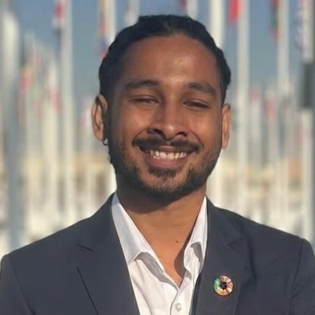

```{r}
#| label: setup
source(file.path(Sys.getenv("QUARTO_PROJECT_DIR", "."), "R", "site.R"))
```

::: {.profile-photo-wrap}
{.profile-photo fig-alt="Portrait of Ravindu Nawanjana" width="300" height="360"}
:::

<h1 class="home-name">Ravindu Nawanjana</h1>

[I work on climate finance in developing economies. My research asks why climate finance reaches so few of the places that need it, and how stock exchanges, multilateral climate funds and development banks, central banks and private capital can be organised to lower the cost of capital in emerging markets, the Group of 77 and China, and Small Island Developing States.]{.lede}

I completed an MSc in International Banking and Finance at the Guildhall School of Business and Law, London Metropolitan University, in August 2026, and I am a prospective PhD student in environmental economics. My MSc dissertation combined a survey of 103 climate finance professionals with eight interviews with practitioners at UNDP, UNCDF, UN Sustainable Stock Exchanges, FAO, the African Development Bank, the Asian Development Bank, the World Bank GEF, a central bank and a private capital firm. From that work I developed the [Institutional Reinforcement Cycle](research/multilateral-climate-funds.qmd#the-institutional-reinforcement-cycle), a model in which institutional collaboration, policy alignment, blended finance and transparency act as complements, so that weakness in any one of them can stall the whole system.

I do my quantitative work in R and Quarto, with Python, Stata and SPSS where a project needs them, and I keep it public. Each paper has a [repository](code.qmd) that reproduces its statistics from the survey data. Alongside research, I am Head of Impact Investments and Sustainability at Kangara Holdings in Colombo, where I work on agricultural and forestry carbon credit programmes under Verra methodologies, and I review for *Economic Change and Restructuring* (Springer Nature).

::: {.home-edu}
- MSc International Banking and Finance, London Metropolitan University, August 2026
- BSc (Hons) Banking and Finance, London Metropolitan University, August 2025
:::

:::: {.contact-list}
- [View and Download CV](assets/cv/Ravindu_Nawanjana_CV.pdf){target="_blank"}
- [gmn0021@my.londonmet.ac.uk](mailto:gmn0021@my.londonmet.ac.uk)
- [LinkedIn](https://www.linkedin.com/in/ravindunawanjana/)
- [Google Scholar](https://scholar.google.com/citations?user=djgLs4EAAAAJ&hl=en)
- [ORCID](https://orcid.org/0009-0009-8594-0248)
- [GitHub](https://github.com/RavinduNawanjana)
::::

## Research

```{r}
home_papers()
```

[Papers, research statements and writing sample](research.qmd)

## News

```{r}
news_list(6)
```
