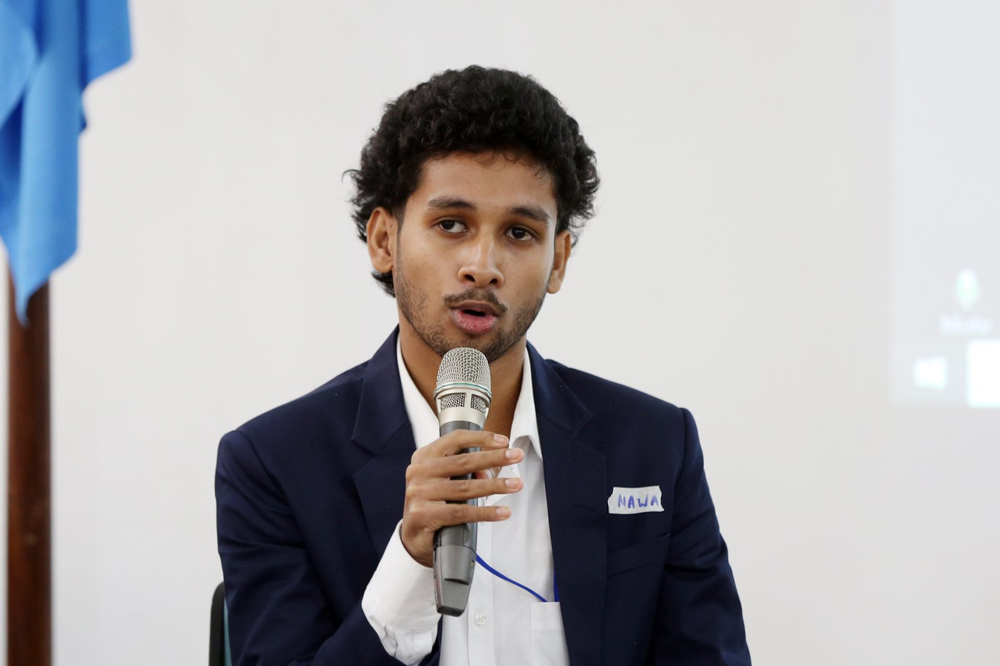

```{r}
#| label: setup
source(file.path(Sys.getenv("QUARTO_PROJECT_DIR", "."), "R", "site.R"))
```

## Remarks at the 5th Forum of Ministers and Environment Authorities of Asia-Pacific {#remarks}

[UNEP, Colombo, October 2023. Video published by the Ministry of Environment, Sri Lanka.]{.photo-credit}



> "Fifty percent - that's the share of Asia-Pacific's biodiversity already lost. What's left won't be saved by ecology alone; it will be saved by economics. The policies drafted today become the financial and ecological reality the next generation inherits, which means protecting natural capital can no longer sit outside the models that drive markets and policy. That intersection, where environmental urgency meets economic rigor, is where the real work has to happen next."

[Watch on YouTube](https://youtu.be/hzbuuYGBDK0){target="_blank"}

## Earth Negotiations Bulletin (IISD) {#press}

Photographed and credited by the *Earth Negotiations Bulletin*, a publication of the International Institute for Sustainable Development, in its coverage of my remarks on youth engagement in social entrepreneurship at the Science-Policy-Business Forum youth segment of the Asia Pacific Youth Environment Forum, held with the 5th Forum of Ministers and Environment Authorities of Asia-Pacific in Colombo, October 2023.

{.photo fig-alt="Ravindu Nawanjana speaking at the 5th Forum of Ministers and Environment Authorities of Asia-Pacific"}

[[View on the Earth Negotiations Bulletin site]](https://enb.iisd.org/media/ravindu-nawanjana-founder-and-ceo-cutefela){target="_blank"} &nbsp;|&nbsp; [[ENB coverage of the forum]](https://enb.iisd.org/forum-ministers-environment-authorities-asia-pacific-5-2oct2023){target="_blank"}

## UN conferences {#un-conferences}

```{r}
dated_list(read_site("conferences"), "year")
```
