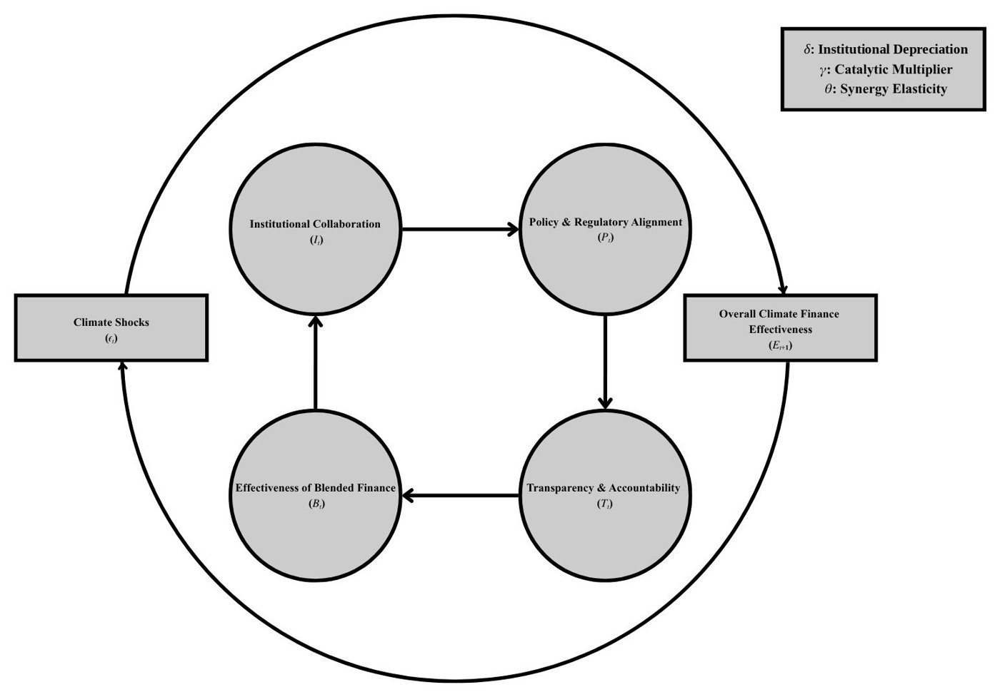
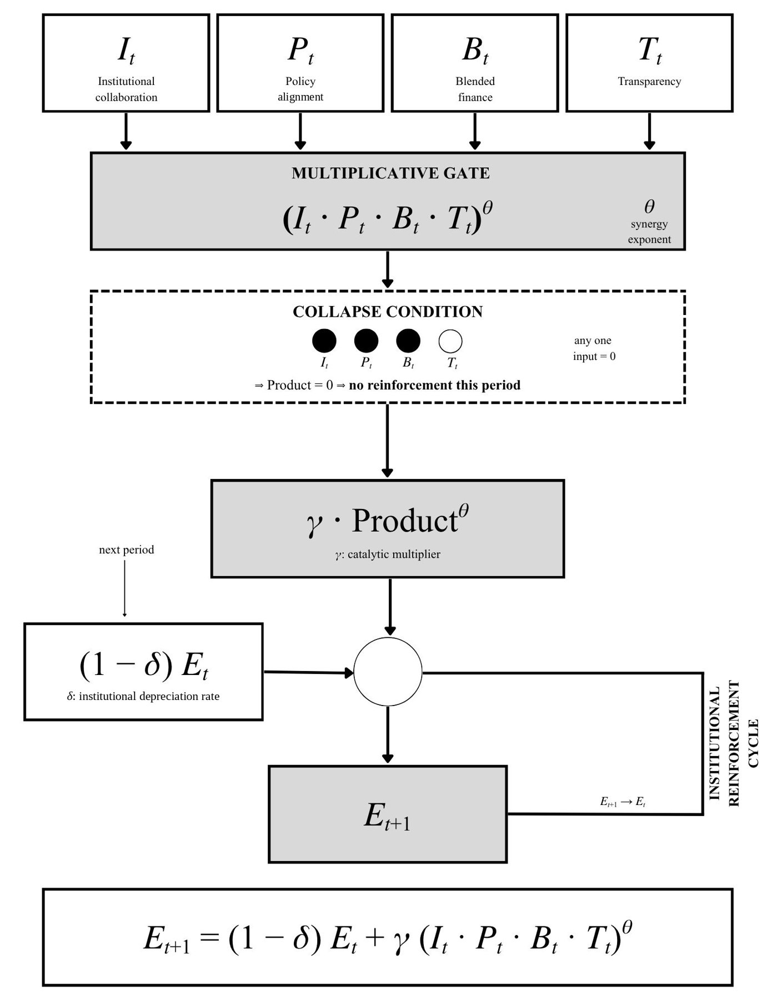

```{r}
#| label: setup
source(file.path(Sys.getenv("QUARTO_PROJECT_DIR", "."), "R", "site.R"))
```

[[Research](../research.html) / Multilateral climate funds]{.breadcrumb}

```{r}
paper_links("mcf")
```

## Abstract

Multilateral climate funds (MCFs) are expected to move capital at scale into the Group of 77 (G77) and China, yet a large climate finance gap persists. Drawing on institutional economics and research on fragmented climate governance, this study examines how institutional collaboration, blended finance deployment, policy and regulatory alignment, and transparency shape the operational architecture of MCFs. It combines a survey of 103 sustainable finance specialists with eight semi-structured interviews with practitioners at multilateral development banks (MDBs) and climate funds, UN bodies, a central bank and a private capital firm. Interviewees saw blended finance as the main route to mobilising private capital, but described it as held back by fragmented governance, silos between vertical funds and MDBs, and regulatory dissonance. In the survey, institutional collaboration was the only factor with a significant, independent association with architecture effectiveness. Interviewees treated policy alignment as a precondition for absorbing capital, and transparency as the basis of investor trust. The study develops an Institutional Reinforcement Cycle, which explains why these determinants act as complements, so that weakness in one of the four can stall the whole system. It concludes that MCFs and MDBs need coordinated platforms that de-risk private investment at scale.

## Main results, reproduced in R {#results}

The numbers below are computed when the site is built, in R, from the anonymised survey responses (103 respondents, 32 five-point Likert items) published in the [study repository](https://github.com/RavinduNawanjana/multilateral-climate-finance-architecture). Each construct is the mean of its items, and the slopes come from an OLS regression on z-scored variables. The table sets them beside the values reported from the original SPSS analysis.

```{r}
#| label: msc-analysis
#| code-fold: true
#| code-summary: "R code for the scores, reliability, correlations and standardised OLS"
#| echo: true
survey <- read.csv(site_path("data", "msc", "survey_responses.csv"))
stopifnot(nrow(survey) == 103, ncol(survey) == 32, all(as.matrix(survey) %in% 1:5))

items <- list(IC = 1:7, BFD = 8:14, PRA = 15:21, TAFU = 22:28, CFA = 29:32)
scores <- as.data.frame(lapply(items, function(i) rowMeans(survey[, i])))
predictors <- c("IC", "BFD", "PRA", "TAFU")

alpha <- sapply(items, function(i) cronbach_alpha(survey[, i]))
r <- sapply(predictors, function(v) cor(scores[[v]], scores$CFA))
r_p <- sapply(predictors, function(v) cor.test(scores[[v]], scores$CFA)$p.value)
ols <- standardised_ols(scores, "CFA", predictors)

spss <- read.csv(site_path("data", "msc", "spss_published_benchmarks.csv"))
reported <- function(metric, v) spss$reported_value[spss$metric == metric & spss$construct_or_variable == v]
```

```{r}
#| label: msc-table
labels <- c(IC = "Institutional collaboration", BFD = "Blended finance deployment",
            PRA = "Policy and regulatory alignment", TAFU = "Transparency and accountability")
rows <- lapply(predictors, function(v) {
  b <- ols$coefs[ols$coefs$construct == v, ]
  tags$tr(
    tags$td(labels[[v]]), tags$td(fmt3(alpha[[v]])),
    tags$td(fmt3(r[[v]])), tags$td(fmt_p(r_p[[v]])),
    tags$td(fmt3(b$beta)), tags$td(fmt_p(b$p)),
    tags$td(fmt3(reported("pearson_r", v)), " / ", fmt3(reported("standardized_beta", v))))
})
out(div(class = "table-wrap", tags$table(class = "data-table results-table",
  tags$caption(HTML(sprintf(
    "Reliability, Pearson correlations with perceived architecture effectiveness, and standardised OLS slopes. N = %d. R<sup>2</sup> = %s, adjusted R<sup>2</sup> = %s (SPSS values .207 and .174). Outcome scale &alpha; = %s.",
    ols$n, fmt3(ols$r2), fmt3(ols$adj_r2), fmt3(alpha[["CFA"]])))),
  tags$thead(tags$tr(tags$th("Construct"), tags$th(HTML("&alpha;")), tags$th("Pearson r"), tags$th("p"),
                     tags$th(HTML("&beta;")), tags$th("p"), tags$th(HTML("SPSS r / &beta;")))),
  tags$tbody(rows))))
```

```{r}
#| label: fig-msc-coefs
#| fig-cap: "Standardised OLS slopes with 95% confidence intervals, computed in R from the survey data. Only institutional collaboration keeps a clear independent association once the other constructs are held fixed."
#| fig-alt: "Dot-and-whisker chart of standardised regression slopes. Institutional collaboration is about 0.39 with an interval well above zero; blended finance, transparency and policy alignment have intervals that cross zero."
#| fig-width: 7
#| fig-height: 3.2
cf <- ols$coefs
cf$label <- factor(labels[cf$construct], levels = rev(labels[cf$construct[order(-cf$beta)]]))
cf$clear <- cf$lo > 0
ggplot(cf, aes(beta, label)) +
  geom_vline(xintercept = 0, colour = site_colours[["grey"]], linewidth = 0.4) +
  geom_errorbar(aes(xmin = lo, xmax = hi, colour = clear), width = 0, linewidth = 1, orientation = "y") +
  geom_point(aes(colour = clear), size = 3) +
  geom_text(aes(label = fmt3(beta)), nudge_y = 0.3, size = 3.4, family = "serif", colour = site_colours[["ink"]]) +
  scale_colour_manual(values = c(`TRUE` = site_colours[["leaf"]], `FALSE` = site_colours[["grey"]]), guide = "none") +
  labs(x = "Standardised slope (95% CI)", y = NULL) +
  theme_site()
```

As an independent check, the same regression is run again in Python with NumPy's least-squares solver on the scores R computed.

```{python}
#| label: msc-python
#| code-fold: true
#| code-summary: "Python code for the independent least-squares check"
#| echo: true
import numpy as np

scores = np.column_stack([np.asarray(r.scores[c], dtype=float) for c in ["CFA", "IC", "BFD", "PRA", "TAFU"]])
z = (scores - scores.mean(axis=0)) / scores.std(axis=0, ddof=1)
y, X = z[:, 0], np.column_stack([np.ones(len(z)), z[:, 1:]])
beta, *_ = np.linalg.lstsq(X, y, rcond=None)
py_betas = beta[1:].tolist()
```

```{r}
#| label: msc-crosscheck
py <- unlist(reticulate::py$py_betas)
diff_py <- max(abs(py - ols$coefs$beta))
diff_spss <- max(abs(round(ols$coefs$beta, 3) - sapply(predictors, function(v) reported("standardized_beta", v))))
out(tags$p(
  sprintf("R and Python slopes agree to within %s. %s",
          format(signif(diff_py, 2), scientific = TRUE),
          if (diff_spss < 0.0005) "Rounded to three decimals, the R slopes match the SPSS-reported values exactly."
          else sprintf("Rounded to three decimals, the R slopes differ from the SPSS-reported values by at most %s.", formatC(diff_spss, format = "f", digits = 3)))))
```

The survey numbers are associations among perception-based scores from a cross-sectional sample. They do not identify the effect of institutions on actual disbursements or emissions. The interviews explain the rest of the picture. Blended finance is seen as the main catalyst for private capital, policy alignment decides whether capital can be absorbed, and transparency sustains investor trust.

## The Institutional Reinforcement Cycle

{fig-alt="Diagram of the Institutional Reinforcement Cycle: institutional collaboration, policy and regulatory alignment, transparency and accountability, and effectiveness of blended finance in a loop, with climate shocks acting on the cycle and overall climate finance effectiveness as the outcome."}

The cycle treats climate finance effectiveness as the product of its four determinants rather than their sum. Following the theory of complementary inputs, if any one determinant approaches zero, the reinforcing effect of the whole cycle collapses and additional capital cannot make up the difference. Following the literature on increasing returns, effectiveness carries over from one period to the next, so well-coordinated systems tend to improve while poorly coordinated ones stay locked in. Effectiveness evolves as

$$
E_{t+1} = (1-\delta)\,E_t + \gamma\,\left(I_t \cdot P_t \cdot B_t \cdot T_t\right)^{\theta}
$$

where $I$, $P$, $B$ and $T$ are institutional collaboration, policy and regulatory alignment, blended finance effectiveness and transparency; $\delta$ is the rate at which institutional gains depreciate; $\gamma$ is the catalytic multiplier; and $\theta$ is the elasticity of synergy between the determinants. Holding the determinants constant, effectiveness converges to the steady state $E^* = \gamma (IPBT)^{\theta} / \delta$. The model is conceptual and has not been estimated. Identifying $\delta$, $\gamma$ and $\theta$ needs panel data on the four determinants and on realised finance outcomes.

```{r}
#| label: fig-irc-scenarios
#| fig-cap: "Three illustrative paths simulated in R with δ = 0.15, γ = 0.5 and θ = 0.5. The parameters are chosen for illustration, not estimated. Lowering one determinant from 0.7 to 0.1 cuts the steady state from about 1.6 to about 0.6, and setting it to zero leaves only decay."
#| fig-alt: "Line chart of effectiveness over 30 periods. With all four determinants at 0.7, effectiveness rises from 0.5 to about 1.6. With one weak link at 0.1, it settles near 0.6. With one determinant at zero, it decays towards zero."
#| fig-width: 7
#| fig-height: 3.4
scen <- rbind(
  transform(simulate_irc(0.7, 0.7, 0.7, 0.7), scenario = "All four at 0.7"),
  transform(simulate_irc(0.1, 0.7, 0.7, 0.7), scenario = "One weak link (0.1)"),
  transform(simulate_irc(0.0, 0.7, 0.7, 0.7), scenario = "One determinant at zero")
)
scen$scenario <- factor(scen$scenario, levels = unique(scen$scenario))
ggplot(scen, aes(t, E, colour = scenario)) +
  geom_line(linewidth = 1.1) +
  scale_colour_manual(values = c(site_colours[["leaf"]], site_colours[["amber"]], site_colours[["grey"]])) +
  labs(x = "Period", y = expression(E[t])) +
  theme_site() +
  theme(panel.grid.major.y = element_line(colour = "#e7eae4"))
```

### Try the model

Move the sliders to change the determinants and parameters. The path is recomputed in your browser with Observable JavaScript, using the same equation as the R code above.

```{ojs}
//| layout-ncol: 2
viewof I = Inputs.range([0, 1], {value: 0.7, step: 0.05, label: "Collaboration I"})
viewof P = Inputs.range([0, 1], {value: 0.7, step: 0.05, label: "Policy alignment P"})
viewof B = Inputs.range([0, 1], {value: 0.7, step: 0.05, label: "Blended finance B"})
viewof T = Inputs.range([0, 1], {value: 0.7, step: 0.05, label: "Transparency T"})
viewof delta = Inputs.range([0.01, 0.6], {value: 0.15, step: 0.01, label: "Depreciation δ"})
viewof gamma = Inputs.range([0.05, 1.5], {value: 0.5, step: 0.05, label: "Multiplier γ"})
viewof theta = Inputs.range([0.1, 2], {value: 0.5, step: 0.05, label: "Synergy θ"})
viewof E0 = Inputs.range([0, 3], {value: 0.5, step: 0.1, label: "Starting E₀"})
```

```{ojs}
//| echo: false
irc = {
  const R = gamma * Math.pow(I * P * B * T, theta);
  const path = [{t: 0, E: E0, scenario: "Your scenario"}];
  for (let t = 1; t <= 30; t++) path.push({t, E: (1 - delta) * path[t - 1].E + R, scenario: "Your scenario"});
  const Rb = gamma * Math.pow(0.7 ** 4, theta);
  const base = [{t: 0, E: E0, scenario: "All four at 0.7"}];
  for (let t = 1; t <= 30; t++) base.push({t, E: (1 - delta) * base[t - 1].E + Rb, scenario: "All four at 0.7"});
  return {path, base, steady: R / delta, weakest: Math.min(I, P, B, T)};
}
```

```{ojs}
//| echo: false
Plot.plot({
  width: Math.min(width, 860),
  height: 300,
  marginLeft: 48,
  style: {fontFamily: "Georgia, serif", fontSize: "13px", background: "transparent"},
  x: {label: "Period", grid: false},
  y: {label: "Effectiveness Eₜ", grid: true, domain: [0, Math.max(2, irc.steady * 1.1, E0 * 1.1)]},
  color: {domain: ["Your scenario", "All four at 0.7"], range: ["#2f6d4f", "#9aa39c"], legend: true},
  marks: [
    Plot.ruleY([irc.steady], {stroke: "#2f6d4f", strokeDasharray: "4,4", strokeOpacity: 0.6}),
    Plot.line(irc.base, {x: "t", y: "E", stroke: "scenario", strokeWidth: 1.5, strokeDasharray: "2,3"}),
    Plot.line(irc.path, {x: "t", y: "E", stroke: "scenario", strokeWidth: 2.5}),
    Plot.ruleY([0])
  ]
})
```

```{ojs}
//| echo: false
html`<p class="muted">Steady state E* = <strong>${irc.steady.toFixed(2)}</strong>. Weakest determinant = <strong>${irc.weakest.toFixed(2)}</strong>${irc.weakest === 0 ? ": the gate is closed, so effectiveness only decays." : "."}</p>`
```

{.figure-narrow fig-alt="Diagram of the Institutional Reinforcement Cycle drawn as a multiplicative gate with memory, in which the four determinants pass through a single product gate and effectiveness carries over between periods."}

## Recommendations

The paper makes four recommendations. MCFs should act as coordination platforms that link MDBs, central banks and private capital providers, with joint financing platforms and shared risk-assessment matrices to cut transaction costs. Governments in the G77 and China should develop unified green finance taxonomies, enforce mandatory ESG disclosure and keep policy stable, and central banks should build climate-related financial risk into monetary and supervisory frameworks. Blended finance should be scaled through first-loss guarantees, concessional loans and targeted co-financing, particularly in climate-vulnerable SIDS and Least Developed Countries. And standardised performance indicators with verifiable impact reporting would build the investor trust the cycle depends on.

[&larr; Back to research](../research.qmd){.back-link}
